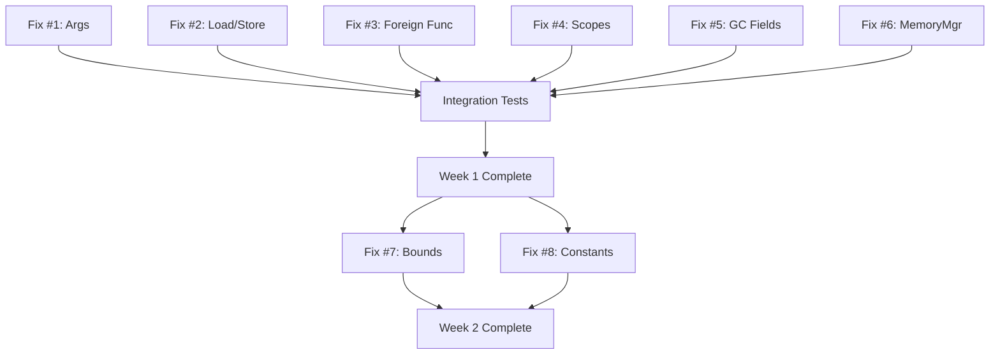

# 🔥 CRITICAL ISSUES SUMMARY - MUST FIX IMMEDIATELY

**Date**: 2025-10-03
**Priority**: P0 - BLOCKING RELEASE

---

## Overview

This document consolidates **all critical bugs** found across bytecode, IR, VM, and GC that **prevent the system from working**. Fix these in priority order.

---

## 🔥🔥🔥 SEVERITY: CRITICAL (System Won't Work)

### 1. Function Call Argument Order Reversed [VM]
**File**: `src/vm/VM.cpp:992-994`

**Problem**:
```cpp
for (int i = argCount - 1; i >= 0; i--) {
    localStack_[localStackTop_ + i] = pop();  // BUG: backwards!
}
```

Pops in reverse order but stores at increasing indices → all function calls get reversed arguments.

**Impact**: **ALL FUNCTION CALLS BROKEN**

**Fix**:
```cpp
for (int i = argCount - 1; i >= 0; i--) {
    localStack_[localStackTop_ + (argCount - 1 - i)] = pop();
}
```

**Estimated Time**: 15 minutes

---

### 2. Load/Store Opcode Mismatch [VM + Bytecode]
**Files**:
- `src/vm/VM.cpp:759-831`
- `src/bytecode/BytecodeCompiler.cpp:359-409`

**Problem**: VM reads `offset` operand that compiler never emits.

**Impact**: **MEMORY OPERATIONS CRASH**

**Fix Option A** (simpler): Remove offset from VM
```cpp
void VM::execLoad() {
    Value address = pop();
    expectType(address, ValueType::Object, "Load");
    // Load from object directly - no offset
}
```

**Fix Option B** (more flexible): Add offset to compiler
```cpp
void BytecodeCompiler::compileLoadInst(...) {
    emitLoadValue(inst->address(), chunk);
    chunk.emitOpcode(Opcode::Load);
    chunk.emitInt32(0);  // Add offset operand
}
```

**Estimated Time**: 2-4 hours

---

### 3. Foreign Function Table Never Built [VM]
**File**: `src/vm/VM.cpp:24`

**Problem**: Comment says build table but implementation missing.

**Impact**: **CANNOT CALL FOREIGN FUNCTIONS** (print, etc.)

**Fix**:
```cpp
// In VM constructor after module is set:
for (const auto& name : module_->foreignFunctions()) {
    auto it = ForeignFunctionRegistry::instance().find(name);
    if (it != ForeignFunctionRegistry::instance().end()) {
        nativeFunctionTable_.push_back(it->second);
    } else {
        throw std::runtime_error("Undefined foreign function: " + name);
    }
}
```

Also need to create `ForeignFunctionRegistry` singleton.

**Estimated Time**: 4-6 hours

---

### 4. IR Generator Scope Management Broken [IR]
**File**: `src/IR/IRGenerator.cpp:1070-1072`

**Problem**: Flat map - no scope stack.

```cpp
void IRGenerator::declareVariable(const std::string& name, Value* value) {
    variableMap_[name] = value;  // NO SCOPING!
}
```

**Impact**: **VARIABLE SHADOWING DOESN'T WORK**

**Fix**: Implement scope stack:
```cpp
class ScopeManager {
    std::vector<std::unordered_map<std::string, Value*>> scopes_;
public:
    void pushScope() { scopes_.emplace_back(); }
    void popScope() { scopes_.pop_back(); }
    void declare(const std::string& name, Value* value) {
        scopes_.back()[name] = value;
    }
    Value* lookup(const std::string& name) {
        for (auto it = scopes_.rbegin(); it != scopes_.rend(); ++it) {
            auto found = it->find(name);
            if (found != it->end()) return found->second;
        }
        return nullptr;
    }
};
```

**Estimated Time**: 4-6 hours

---

### 5. GC Field Count Calculation Wrong [GC]
**File**: `src/vm/GC.cpp:404-407`

**Problem**: Incorrect calculation of struct field count during marking.

```cpp
size_t totalHeaderSize = sizeof(GCHeader) + sizeof(ObjectHeader);
size_t fieldsSize = objHeader->size - totalHeaderSize;
size_t fieldCount = fieldsSize / sizeof(Value);
```

But `objHeader->size` includes `GCHeader` and `StructObject` has `ObjectHeader` **inside** it.

**Impact**: **WRONG FIELD COUNT → SOME FIELDS NOT MARKED → USE-AFTER-FREE**

**Fix Option A**: Store field count in object
```cpp
struct StructObject {
    ObjectHeader header;
    uint32_t fieldCount;  // Add this
    Value fields[1];
};
```

**Fix Option B**: Fix calculation
```cpp
// StructObject = ObjectHeader + fields[1], so:
size_t structBaseSize = sizeof(ObjectHeader) + sizeof(Value);
size_t extraFieldsSize = objHeader->size - sizeof(GCHeader) - structBaseSize;
size_t fieldCount = 1 + (extraFieldsSize / sizeof(Value));
```

**Estimated Time**: 2-3 hours

---

### 6. MemoryManager References Non-Existent Allocators [Architecture]
**File**: `include/vm/MemoryManager.hpp:239-245`

**Problem**: References `Arena`, `FreeListAllocator`, `PageAllocator`, `SlabAllocator` that **don't exist**.

**Impact**: **CODE DOESN'T COMPILE IF MemoryManager IS USED**

**Options**:

**Option A** (quick): Remove MemoryManager entirely, use GC directly
- Delete `MemoryManager.hpp` and `MemoryManager.cpp`
- Have VM use `GarbageCollector` directly

**Option B** (proper): Implement the allocators
- Create `Arena` (bump-pointer allocator)
- Create `FreeListAllocator` (size-segregated free lists)
- Create `PageAllocator` (large objects)
- Create `SlabAllocator` (fixed-size objects)

**Recommended**: Option A for now (remove dead code), Option B for future optimization.

**Estimated Time**:
- Option A: 1 hour
- Option B: 2-3 weeks

---

## ⚠️ SEVERITY: HIGH (Will Crash in Production)

### 7. Missing Bounds Checks [VM]
**Files**: `src/vm/VM.cpp` (multiple locations)

**Locations**:
- Global access: line 740-748
- GetField: line 833-853
- Array access: (various)

**Impact**: **OUT-OF-BOUNDS ACCESS → CRASHES**

**Fix**: Add bounds checks everywhere:
```cpp
void VM::execLoadGlobal() {
    int32_t globalIndex = readInt32();
    if (globalIndex < 0 || globalIndex >= globals_.size()) {
        runtimeError("Global index out of bounds");
    }
    push(globals_[globalIndex]);
}
```

**Estimated Time**: 4-6 hours

---

### 8. Constant Memory Management [IR]
**File**: `include/IR/IRBuilder.hpp:226-231`

**Problem**: Constants owned by IRBuilder via unique_ptr, but IR holds raw pointers.

**Impact**: **USE-AFTER-FREE when IRBuilder destroyed**

**Fix**: Module owns constants:
```cpp
class IRModule {
    std::vector<std::unique_ptr<Constant>> constants_;
public:
    Constant* addConstant(std::unique_ptr<Constant> c) {
        constants_.push_back(std::move(c));
        return constants_.back().get();
    }
};
```

**Estimated Time**: 3-4 hours

---

## ⚠️ SEVERITY: MEDIUM (Bugs But Won't Crash Immediately)

### 9. Primitive Allocation Inconsistency [Bytecode]
**File**: `src/bytecode/BytecodeCompiler.cpp:329-357`

Primitives use local slots, structs use heap. Inconsistent memory model.

**Estimated Time**: 4-6 hours

### 10. 350-Line Assignment Handler [IR]
**File**: `src/IR/IRGenerator.cpp:540-654`

Tangled code, hard to maintain. Needs refactoring to unified GetElementPtr.

**Estimated Time**: 1 week

---

## Priority Order for Fixing

### Week 1: Stabilization (P0 Bugs)
**Days 1-2**:
1. Fix function call argument order (15 min)
2. Fix Load/Store mismatch (4 hours)
3. Start foreign function table (6 hours)

**Days 3-4**:
4. Complete foreign function table
5. Fix scope management (6 hours)

**Day 5**:
6. Fix GC field count calculation (3 hours)
7. Remove MemoryManager or implement allocators (decision + implementation)

**Weekend**: Run integration tests

### Week 2: Safety (High Priority)
**Days 1-2**:
7. Add all bounds checks (6 hours)
8. Fix constant memory management (4 hours)

**Days 3-5**:
- Write integration tests
- Fix any crashes found during testing

### Week 3+: Quality (Medium Priority)
9. Refactor primitive allocation
10. Refactor assignment handling
11. Add optimization passes

---

## Testing Strategy

### Phase 1: Unit Tests (After Each Fix)
Run existing tests:
```bash
cd build
ctest --output-on-failure
```

### Phase 2: Integration Tests (After Week 1)
Write end-to-end tests:
```cpp
TEST(Integration, SimpleFunctionCall) {
    auto source = R"(
        fn add(a: int, b: int) -> int {
            return a + b
        }
        result := add(3, 5)
    )";

    // Parse → Analyze → IR → Bytecode → VM
    auto result = compileAndRun(source);
    EXPECT_EQ(result.asInt, 8);
}
```

### Phase 3: Stress Tests (After Week 2)
- Recursive functions (test stack)
- Large arrays (test GC)
- Deep nesting (test scopes)
- Long-running programs (test memory leaks)

---

## How to Track Progress

Create a tracking spreadsheet or use GitHub issues:

| # | Issue | Status | Assigned | ETA |
|---|-------|--------|----------|-----|
| 1 | Function call args | 🔴 Not Started | - | - |
| 2 | Load/Store mismatch | 🔴 Not Started | - | - |
| 3 | Foreign function table | 🔴 Not Started | - | - |
| ... | ... | ... | ... | ... |

Status:
- 🔴 Not Started
- 🟡 In Progress
- 🟢 Done
- ⚪ Blocked

---

## Dependencies Between Fixes



All 6 critical fixes must be done before integration testing.

---

## Validation Checklist

After fixing all critical bugs, verify:

- [ ] Simple function calls work (args in correct order)
- [ ] Struct field access works (Load/Store fixed)
- [ ] Built-in functions work (foreign functions)
- [ ] Variable shadowing works (scopes)
- [ ] GC doesn't collect live objects (field marking)
- [ ] No crashes on array/struct access (bounds checks)
- [ ] IR doesn't leak memory (constant ownership)

---

## Resources Needed

- **Time**: 2-3 weeks full-time for all critical fixes
- **Skills**: C++ expertise, compiler knowledge, GC understanding
- **Tools**: Debugger (gdb/lldb), AddressSanitizer, Valgrind
- **Tests**: Expand test suite from 225 to 500+ tests

---

**Bottom Line**: The system has 6 critical bugs that **must** be fixed before it can execute even simple programs correctly. Budget 2-3 weeks for stabilization, then 2-3 more weeks for quality improvements. The architecture is sound - it just needs these implementation bugs fixed.

**Next Steps**:
1. Fix critical bugs in priority order
2. Run tests after each fix
3. Write integration tests
4. Stabilize before adding features
